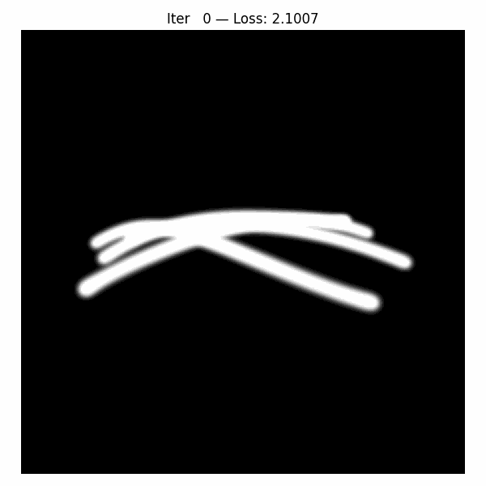

# From Pixels to Wireframes: 3D Reconstruction via CLIP-Based Sketch Abstraction

<p align="center">
  
</p>

This repository contains the project proposal and pseudocode for “From Pixels to Wireframes,” a method for generating **3D sketch abstractions** using CLIP-based losses and Bézier curves on reconstructed surfaces.

---

## Project Structure

```
clipasso3d/
├── CLIP_/                    
├── data/
│   ├── snake.jpg
│   ├── test.jpeg
│   ├── test.png
│   └── transforms_train.json
├── notebooks/
│   ├── 2DCLIPSetting.ipynb
│   ├── CLIPLoss.ipynb
│   ├── GaussianRender.ipynb
│   └── training_evolution.gif
├── source/
│   ├── __pycache__/
│   ├── beziercurve.py
│   ├── cliploss.py
│   ├── diffrasterizer.py
│   └── utils.py
├── .gitignore
├── .gitmodules
├── README.md
└── requirements.txt
```


---

## Setup & Installation

**Clone the repository:**
   ```bash
   git clone https://github.com/tarhanefe/clipasso3d.git
   cd clipasso3d
   ```

**Create a new Conda environment with python version 3.10:**
   ```bash
   conda create -n 3dsketch python=3.10 -y
   conda activate 3dsketch
   ```
**Install Pytorch for Cuda version 12.1:**
   ```bash
   pip install torch torchvision torchaudio --index-url https://download.pytorch.org/whl/cu121
   ```

**Install library requirements:**
   ```bash
   pip install -r requirements.txt
   ```
---

## Demo
### A snake
<p align="center">
  
</p>


<p align="center">
  
</p>
