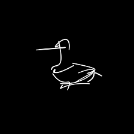

# From Pixels to Wireframes: 3D Reconstruction via CLIP-Based Sketch Abstraction

<p align="center">
  
</p>

This repository contains the project proposal and pseudocode for “From Pixels to Wireframes,” a method for generating **3D sketch abstractions** using CLIP-based losses and Bézier curves on reconstructed surfaces.

---

# Project Structure

```
clipasso3d/
├── CLIP_/                    
├── data/
├── notebooks/
├── source/
├── .gitignore
├── .gitmodules
├── README.md
└── requirements.txt
```

---

# Setup & Installation

**Clone the repository:**
   ```bash
   git clone --recurse-submodules https://github.com/tarhanefe/clipasso3d.git
   cd clipasso3d
   ```

**Create a new Conda environment with python version 3.10:**
   ```bash
   conda create -n 3dsketch python=3.10 -y
   conda activate 3dsketch
   ```
**Install Pytorch for Cuda version 12.1:**
   ```bash
   pip install torch==2.5.1 torchvision==0.20.1 torchaudio==2.5.1 --index-url https://download.pytorch.org/whl/cu121
   ```

**Install library requirements:**
   ```bash
   pip install -r requirements.txt
   ```
---

# Demo

## Single View 3D Generations

### A snake


<table align="center">
  <tr>
    <td align="center"><br>Evolution of the Model From 1 Viewpoint</td>
    <td align="center"><br>Original Image</td>
  </tr>
</table>

### A giraffe

<table align="center">
  <tr>
    <td align="center"><br>Evolution of the Model From 1 Viewpoint</td>
    <td align="center"><br>Original Image</td>
  </tr>
</table>

### A dolphin

<table align="center">
  <tr>
    <td align="center"><br>Evolution of the Model From 1 Viewpoint</td>
    <td align="center"><br>Original Image</td>
  </tr>
</table>


## Multi View 3D Generations

### The plant 


<table align="center">
  <tr>
    <td align="center"><br>Training of the Model</td>
    <td align="center"><br>Model w/ 3D Plant Model</td>
    <td align="center"><br>Model w/ Ground Truth Plant</td>
  </tr>
</table>


### The rose 

<table align="center">
  <tr>
    <td align="center"><br>Model w/ 5 Curves</td>
    <td align="center"><br>Model w/ 10 Curves</td>
    <td align="center"><br>Model w/ 15 Curves</td>
  </tr>
</table>
<table align="center">
  <tr>
    <td align="center"><br>Model w/ 20 Curves</td>
    <td align="center"><br>Model w/ 25 Curves</td>
    <td align="center"><br>Ground Truth Scene</td>
  </tr>
</table>


### The duck 

<table align="center">
  <tr>
    <td align="center"><br>Model w/ 0.02 Thickness</td>
    <td align="center"><br>Model w/ 0.04 Thickness</td>
    <td align="center"><br>Ground Truth Scene</td>
  </tr>
</table>
</table>

