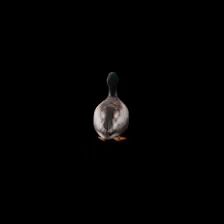

# From Pixels to Wireframes: 3D Reconstruction via CLIP-Based Sketch Abstraction

<p align="center">
  
</p>

This repository contains the project proposal and pseudocode for “From Pixels to Wireframes,” a method for generating **3D sketch abstractions** using CLIP-based losses and Bézier curves on reconstructed surfaces.

---

# Project Structure

```
clipasso3d/
├── CLIP_/                    
├── data/
├── notebooks/
├── source/
├── .gitignore
├── .gitmodules
├── README.md
└── requirements.txt
```

---

# Setup & Installation

**Clone the repository:**
   ```bash
   git clone --recurse-submodules https://github.com/tarhanefe/clipasso3d.git
   cd clipasso3d
   ```

**Create a new Conda environment with python version 3.10:**
   ```bash
   conda create -n 3dsketch python=3.10 -y
   conda activate 3dsketch
   ```
**Install Pytorch for Cuda version 12.1:**
   ```bash
   pip install torch==2.5.1 torchvision==0.20.1 torchaudio==2.5.1 --index-url https://download.pytorch.org/whl/cu121
   ```

**Install library requirements:**
   ```bash
   pip install -r requirements.txt
   ```
---
# How to Use ? 

## 1- Trial Notebook

Use ```WireframeTrial.ipynb```  notebook inside the notebooks folder to interactively examine the training process and obtained results.

## 2- Run file 

```bash
  cd clipasso3d
  python run.py \
  --data_name rose \
  --save_dir training_frames \
  --output_gif training_evolution.gif \
  --batch_size 1 \
  --epochs 10 \
  --inner_steps 30 \
  --learning_rate 0.005 \
  --n_curves 25 \
  --thickness 0.02 \
  --radius 0.8 \
  --length 0.02 \
  --overlap 0.6 \
  --clip_weight 1.0 \
  --clip_conv_loss 1.0 \
  --clip_fc_loss_weight 0.1 \
  --clip_conv_layer_weights 0 0 1.0 1.0 0.0 \
  --gif_fps 120 \
  --rotation_time 6.0 \
  --revolutions 3.0 \
  --output_semigif semihelical.gif
```
where 

### 🔧 Argument Descriptions

| Argument                     | Description                                                                 |
|-----------------------------|-----------------------------------------------------------------------------|
| `--data_name`               | Name of dataset folder inside `../data/` (e.g., `rose`).                    |
| `--save_dir`                | Directory to save per-batch visualization frames.                           |
| `--output_gif`              | Path to save the training evolution GIF.                                    |
| `--batch_size`              | Number of images processed per training batch.                              |
| `--epochs`                  | Number of training epochs.                                                  |
| `--inner_steps`             | Inner optimization steps per batch.                                         |
| `--learning_rate`           | Learning rate for Adam optimizer.                                           |
| `--n_curves`                | Number of Bézier curves initialized in the scene.                           |
| `--thickness`               | Radius (thickness) of each rendered curve/sphere segment.                   |
| `--radius`                  | Distance from the scene center to place initial curve points.               |
| `--length`                  | Length of each curve segment.                                               |
| `--overlap`                 | Degree of allowed overlap between nearby curves.                            |
| `--clip_weight`             | Total CLIP loss weight.                                                     |
| `--clip_conv_loss`          | Weight of the convolutional CLIP loss.                                      |
| `--clip_fc_loss_weight`     | Weight of CLIP’s final-layer (semantic) similarity loss.                    |
| `--clip_conv_layer_weights` | Weights for each CLIP convolutional layer (ViT-B/32 has 5 layers).          |
| `--gif_fps`                 | Frame rate (FPS) of generated GIFs.                                         |
| `--rotation_time`           | Duration (in seconds) of 3D camera rotation in the fly-around GIF.          |
| `--revolutions`             | Number of full revolutions in the semihelical fly-around.                   |
| `--output_semigif`          | Output path for the 3D rendered semihelical GIF animation.                  |

---

## Examples

#### The plant 


<table align="center">
  <tr>
    <td align="center"><br>Training of the Model</td>
    <td align="center"><br>Model w/ 3D Plant Model</td>
    <td align="center"><br>Model w/ Ground Truth Plant</td>
  </tr>
</table>


#### The rose 

<table align="center">
  <tr>
    <td align="center"><br>Model w/ 5 Curves</td>
    <td align="center"><br>Model w/ 10 Curves</td>
    <td align="center"><br>Model w/ 15 Curves</td>
  </tr>
</table>
<table align="center">
  <tr>
    <td align="center"><br>Model w/ 20 Curves</td>
    <td align="center"><br>Model w/ 25 Curves</td>
    <td align="center"><br>Ground Truth Scene</td>
  </tr>
</table>


#### The duck 

<table align="center">
  <tr>
    <td align="center"><br>Model w/ 0.02 Thickness</td>
    <td align="center"><br>Model w/ 0.04 Thickness</td>
    <td align="center"><br>Ground Truth Scene</td>
  </tr>
</table>
</table>

